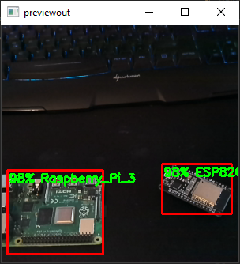

# Tensorflow OD API models on the OpenCV AI Kit

[](https://github.com/tensorflow/tensorflow/releases/tag/v1.15.0)



## Introduction

In order to run a Tensorflow Object Detection API model on the OpenCV AI Kit, the Tensorflow model needs to be converted to a .blob file. For this, we'll first convert the Tensorflow model to an OpenVINO IR model, and then we'll convert the IR model to a .blob file.

## Convert Tensorflow model to OpenVINO IR

To get started, you'll first need a model. For this guide, you can either use a pre-trained model from the [Tensorflow Model zoo](https://github.com/tensorflow/models/blob/master/research/object_detection/g3doc/tf1_detection_zoo.md), or train your own custom model as described in [one of my other Github repositories](https://github.com/TannerGilbert/Tensorflow-Lite-Object-Detection-with-the-Tensorflow-Object-Detection-API/tree/v1). 

> *Note:* Make sure to use Tensorflow 1 as Tensorflow 2 doesn't seem to work yet.

After you have an exported model (.pb file), you can convert it into an OpenVINO IR model using the  [OpenVINO model optimizer](https://docs.openvinotoolkit.org/latest/openvino_docs_MO_DG_Deep_Learning_Model_Optimizer_DevGuide.html):

1. Installation
    ```python
    import os
    from urllib.parse import urlparse

    ## install tools. Open Vino takes some time to download - it's ~400MB
    !sudo apt-get install -y pciutils cpio
    !sudo apt autoremove

    ## downnload installation files
    url = "https://registrationcenter-download.intel.com/akdlm/irc_nas/17662/l_openvino_toolkit_p_2021.3.394.tgz"
    !wget {url}

    ## Get the name of the tgz
    parsed = urlparse(url)
    openvino_tgz = os.path.basename(parsed.path)
    openvino_folder = os.path.splitext(openvino_tgz)[0]

    ## Extract & install openvino
    !tar xf {openvino_tgz}
    %cd {openvino_folder}
    !./install_openvino_dependencies.sh && \
        sed -i 's/decline/accept/g' silent.cfg && \
        ./install.sh --silent silent.cfg
    ```
2. Convert model
    ```
    output_dir = '/content/output'

    %cd '/content/ssd_mobilenet_v2_coco_2018_03_29/'
    !source /opt/intel/openvino_2021/bin/setupvars.sh && \
        python /opt/intel/openvino_2021/deployment_tools/model_optimizer/mo.py \
        --input_model frozen_inference_graph.pb \
        --tensorflow_use_custom_operations_config /opt/intel/openvino_2021/deployment_tools/model_optimizer/extensions/front/tf/ssd_v2_support.json \
        --tensorflow_object_detection_api_pipeline_config /content/ssd_mobilenet_v2_coco.config \
        --reverse_input_channels \
        --output_dir {output_dir} \
        --data_type FP16
    ```

## Compile the IR model to a .blob for use on DepthAI modules/platform

After converting your model into OpenVINO IR format, you can compile it to a .blob file so it can be used on the OpenCV AI Kit using the [online BlobConverter app from Luxonis](https://github.com/luxonis/blobconverter), which can be used with the following code.

```python
xmlfile = f'{output_dir}/frozen_inference_graph.xml'
binfile = f'{output_dir}/frozen_inference_graph.bin'
!python -m pip install blobconverter

import blobconverter
blob_path = blobconverter.from_openvino(
    xml=xmlfile,
    bin=binfile,
    data_type="FP16",
    shaves=5,
)
from google.colab import files
files.download(blob_path) 
```

## Use new model on the OAK Device

To use the model, just replace the model.blob file inside the model directory with your custom model and then change the labels inside the [run_object_detection.py file](run_object_detection.py).

After following the above steps, you can run the model by running the `run_object_detection.py` script.

```
python run_object_detection.py
```

